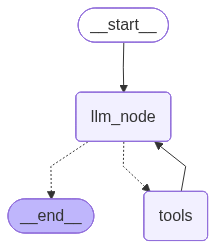

# Goal Getter
An Agentic AI Goal Planning Assistant that seamlessly integrates with Google Workspace and gives actionable insights to keep users on track to meet their goals.

## Agentic AI Details
- Tool calling agent implemented using a LangGraph graph
- State saving (using SqliteSaver) in SQL database for persistent, context-aware chats
- Human-in-the-Loop (HITL) authorization to confirm AI's Google Tasks and Google Calendar edits and Gmail drafts
- Chat separation using Thread IDs
- Tools:
    - Read Google Calendar events
    - Create Google Calendar events
    - Read Google Tasks
    - Create Google Tasks
    - Send Email (to self)

### Graph Architecture:

## Tools / Languages / Frameworks
- Frontend: Javascript + React
- Backend: Python + Flask
- AI Framework: LangGraph
- DB: SQL
- LLM: Gemini
- Authentication: Google Authentication (Sign in with Google)

### User Requirements

- Gemini API Key
    - Uses following model: "gemini-3-flash-preview"
- Must provide access to (upon login):
    - Read + Create Calendar events
    - Read + Create Google Tasks
    - Send Email (to self)

### Developer Requirements

- Must include a client_secrets.json file in backend folder
- Must include a .env file in backend folder with SECRET_APP_KEY
